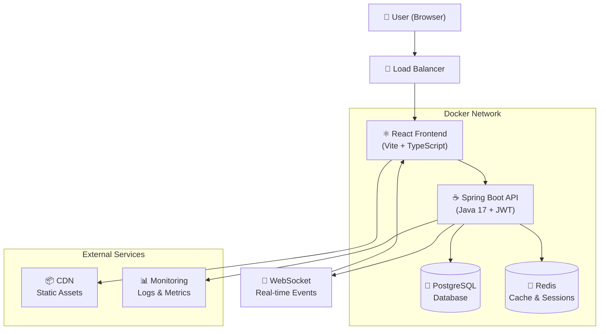
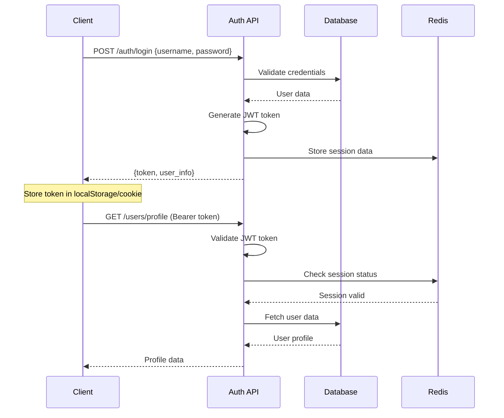

# System Architecture - Waifu Card Game

## Tổng quan kiến trúc

Waifu Card Game sử dụng kiến trúc **microservices** với Spring Boot backend và React frontend, được containerized bằng Docker.

## Architecture Diagram



## Technology Stack

### Backend Stack
| Component | Technology | Version | Purpose |
|-----------|------------|---------|----------|
| **Framework** | Spring Boot | 3.2.0 | REST API & Business Logic |
| **Language** | Java | 17 (LTS) | Main programming language |
| **Build Tool** | Gradle | 8.x | Dependency management & build |
| **Database** | PostgreSQL | 15-alpine | Primary data storage |
| **Cache** | Redis | 7-alpine | Caching & session storage |
| **Security** | Spring Security | 6.x | Authentication & authorization |
| **JWT** | JJWT | 0.11.5 | Token-based authentication |
| **WebSocket** | Spring WebSocket | - | Real-time communication |
| **Validation** | Bean Validation | 3.x | Input validation |

### Frontend Stack
| Component | Technology | Version | Purpose |
|-----------|------------|---------|----------|
| **Framework** | React | 18.2.0 | User interface |
| **Language** | TypeScript | 5.8.3 | Type-safe JavaScript |
| **Build Tool** | Vite | 6.3.5 | Fast development & build |
| **HTTP Client** | Axios | 1.4.0 | API communication |
| **Router** | React Router | 6.3.0 | Client-side routing |
| **WebSocket** | SockJS + STOMP | - | Real-time communication |
| **Testing** | Vitest + Testing Library | - | Unit & integration tests |
| **Linting** | ESLint | 9.25.0 | Code quality |

### Infrastructure Stack
| Component | Technology | Version | Purpose |
|-----------|------------|---------|----------|
| **Containerization** | Docker | 24.x | Application containers |
| **Orchestration** | Docker Compose | 2.x | Multi-container setup |
| **Reverse Proxy** | Nginx | 1.25-alpine | Load balancing & SSL |
| **CI/CD** | GitHub Actions | - | Automated deployment |
| **Monitoring** | Prometheus + Grafana | - | Metrics & monitoring |

## System Components

### 1. Frontend Layer (React + TypeScript)
```
src/
├── components/          # Reusable UI components
│   ├── common/         # Shared components
│   ├── card/           # Card-related components
│   └── gacha/          # Gacha system components
├── pages/              # Route-based page components
├── hooks/              # Custom React hooks
├── services/           # API communication layer
├── store/              # State management (Zustand)
├── types/              # TypeScript type definitions
├── utils/              # Helper functions
└── styles/             # CSS/SCSS files
```

**Key Features:**
- ✅ Responsive design for mobile & desktop
- ✅ Real-time updates via WebSocket
- ✅ Optimistic UI updates
- ✅ Error boundary & loading states
- ✅ Progressive Web App (PWA) features

### 2. Backend Layer (Spring Boot)
```
src/main/java/com/cocin/waifuwar/
├── config/             # Configuration classes
│   ├── SecurityConfig.java
│   ├── WebSocketConfig.java
│   └── RedisConfig.java
├── controller/         # REST API controllers
│   ├── AuthController.java
│   ├── UserController.java
│   ├── CardController.java
│   └── GachaController.java
├── service/            # Business logic layer
│   ├── UserService.java
│   ├── CardService.java
│   ├── GachaService.java
│   └── CollectionService.java
├── repository/         # Data access layer
│   ├── UserRepository.java
│   ├── CardRepository.java
│   └── CollectionRepository.java
├── model/              # JPA entities
│   ├── User.java
│   ├── Card.java
│   ├── Collection.java
│   └── GachaPull.java
├── dto/                # Data transfer objects
├── security/           # Security implementations
├── exception/          # Custom exceptions
├── util/               # Helper utilities
└── validation/         # Custom validators
```

**Key Features:**
- ✅ RESTful API design
- ✅ JWT-based authentication
- ✅ Role-based access control
- ✅ Input validation & sanitization
- ✅ Global exception handling
- ✅ Audit logging
- ✅ Rate limiting

### 3. Database Layer (PostgreSQL)
```sql
-- Core Tables
Users (id, username, email, password_hash, created_at, updated_at)
Cards (id, name, rarity, image_url, description, stats)
Collections (id, user_id, card_id, obtained_at, is_favorite)
Gacha_Pulls (id, user_id, pull_type, cards_obtained, created_at)

-- Future Tables
Battles (id, player1_id, player2_id, status, created_at)
Decks (id, user_id, name, cards, is_active)
Tournaments (id, name, status, start_date, end_date)
```

**Database Features:**
- ✅ ACID compliance
- ✅ Foreign key constraints
- ✅ Indexing for performance
- ✅ Connection pooling (HikariCP)
- ✅ Database migrations (Flyway)
- ✅ Backup & recovery procedures

### 4. Cache Layer (Redis)
```
# Cache Patterns
user_session:{user_id}     # User session data
card_stats:{card_id}       # Card statistics
gacha_rates:current        # Current gacha rates
leaderboard:global         # Global leaderboard
user_collection:{user_id}  # User's card collection
```

**Caching Strategy:**
- **Session Management:** Store JWT tokens & user sessions
- **Data Caching:** Frequently accessed card data
- **Real-time Data:** Leaderboards, statistics
- **Rate Limiting:** API rate limiting counters

## Security Architecture

### Authentication Flow


### Security Measures
- ✅ **Password Security:** BCrypt hashing with salt
- ✅ **JWT Security:** RS256 algorithm, short expiration
- ✅ **Input Validation:** Bean Validation + custom validators
- ✅ **SQL Injection:** Prepared statements (JPA)
- ✅ **CORS Policy:** Configured for frontend domain
- ✅ **Rate Limiting:** Redis-based request throttling
- ✅ **HTTPS Only:** SSL/TLS encryption in production

## Performance Optimization

### Backend Performance
- **Database Optimization:**
  - Connection pooling (max 20 connections)
  - Query optimization with proper indexing
  - Lazy loading for JPA relationships
  - Database query caching

- **Caching Strategy:**
  - Redis for session management
  - Application-level caching for card data
  - HTTP response caching headers

- **Resource Management:**
  - JVM tuning for optimal memory usage
  - Connection pool configuration
  - Async processing for heavy operations

### Frontend Performance
- **Code Splitting:** Route-based lazy loading
- **Bundle Optimization:** Tree shaking + minification
- **Asset Optimization:** Image compression & WebP format
- **CDN Integration:** Static asset delivery
- **Service Worker:** Offline support & caching

## Scalability Considerations

### Horizontal Scaling
- **Stateless Backend:** JWT tokens enable multiple instances
- **Database Replication:** Read replicas for query scaling
- **Load Balancing:** Nginx for traffic distribution
- **Microservices:** Future split into dedicated services

### Monitoring & Observability
- **Application Metrics:** Spring Boot Actuator
- **Database Metrics:** PostgreSQL monitoring
- **Infrastructure Metrics:** Docker container stats
- **Error Tracking:** Centralized logging with ELK stack

## Development Environment

### Local Development Setup
```yaml
# docker-compose.dev.yml
services:
  postgres:
    ports: ["5433:5432"]
    environment:
      POSTGRES_DB: waifu_card_game_dev
  
  redis:
    ports: ["6379:6379"]
  
  backend:
    build: ./backend
    ports: ["8080:8080"]
    environment:
      SPRING_PROFILES_ACTIVE: development
  
  frontend:
    build: ./frontend
    ports: ["3000:3000"]
    volumes: ["./frontend:/app"]
```

### Production Environment
```yaml
# docker-compose.prod.yml
services:
  nginx:
    image: nginx:alpine
    ports: ["80:80", "443:443"]
    volumes: ["./nginx.conf:/etc/nginx/nginx.conf"]
  
  backend:
    build: ./backend
    environment:
      SPRING_PROFILES_ACTIVE: production
    deploy:
      replicas: 3
  
  postgres:
    volumes: ["/data/postgres:/var/lib/postgresql/data"]
    environment:
      POSTGRES_DB: waifu_card_game_prod
```

---

## Next Steps

### Phase 1: Core Features (✅ Complete)
- User authentication & registration
- Card management system
- Basic gacha mechanics
- Collection management

### Phase 2: Enhanced Features (🔄 In Progress)
- Real-time battle system
- Advanced pity mechanics
- Trading between users
- Tournament system

### Phase 3: Advanced Features (📋 Planned)
- Mobile app (React Native)
- AI-powered recommendations
- Blockchain integration for rare cards
- Social features & guilds

*Architecture document được cập nhật thường xuyên để phản ánh những thay đổi trong hệ thống.*